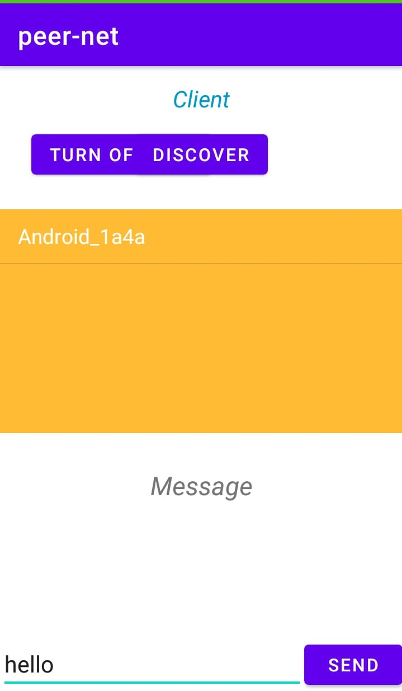
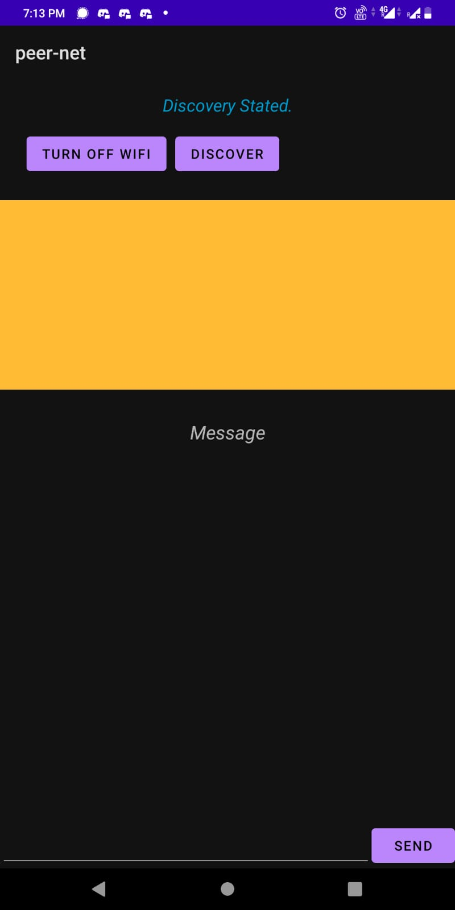
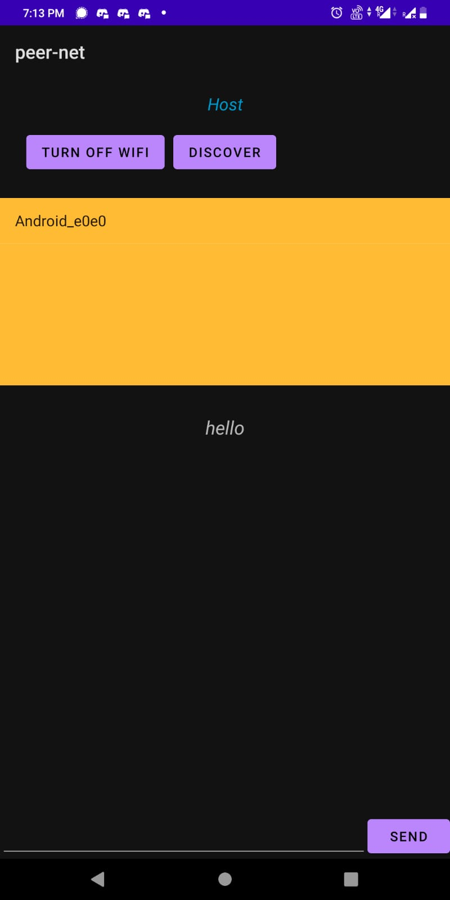

# Peer-net 
Peer-to-peer communication without internet

## Progress till now
A basic app that can find peers on the same network (mobile
hotspot) and connect with them.

- [x] Display nearby devices
- [x] Connect to particular device
- [x] Send a simple message from one device
- [x] Recieve message on another device

##### Screenshots

    
    
    
    
    

#### Current Bugs
- App crashes sometimes while sending message
- App does not automaticaly switches off hotspot (in some mobiles wifi and hotspot do not work simultaneously)

## Next Step
- Add chat interface: On clicking a particular device, chat interface (like whatsapp) should appear.
- Improve user interface
- Auto discover peers available on common network without needing to click Discover on both ends
